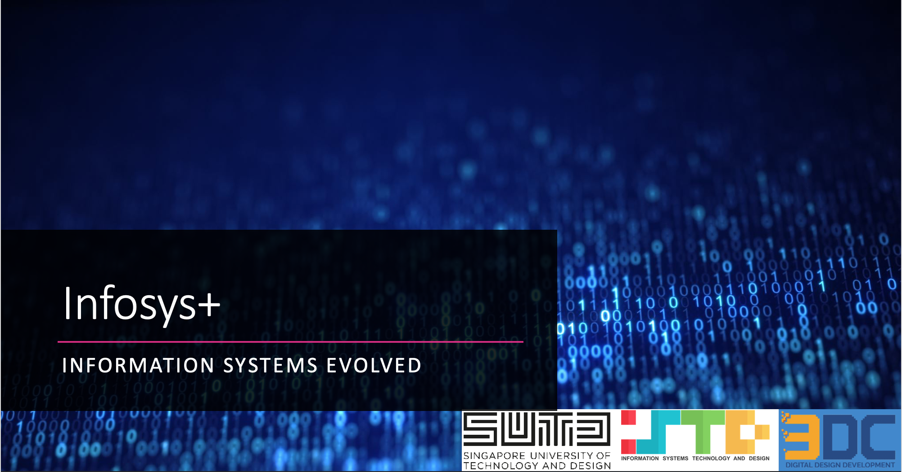
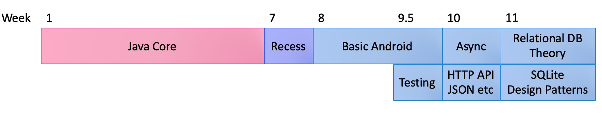
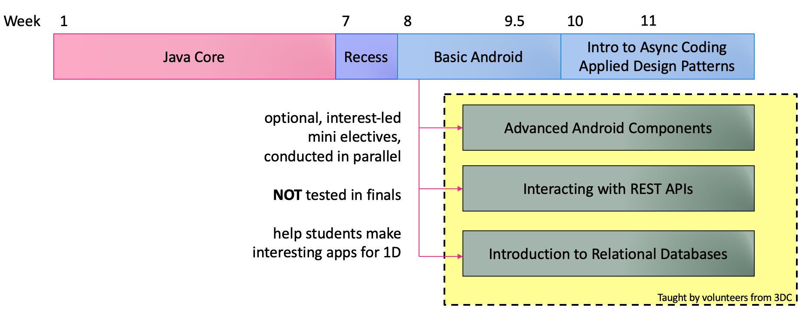
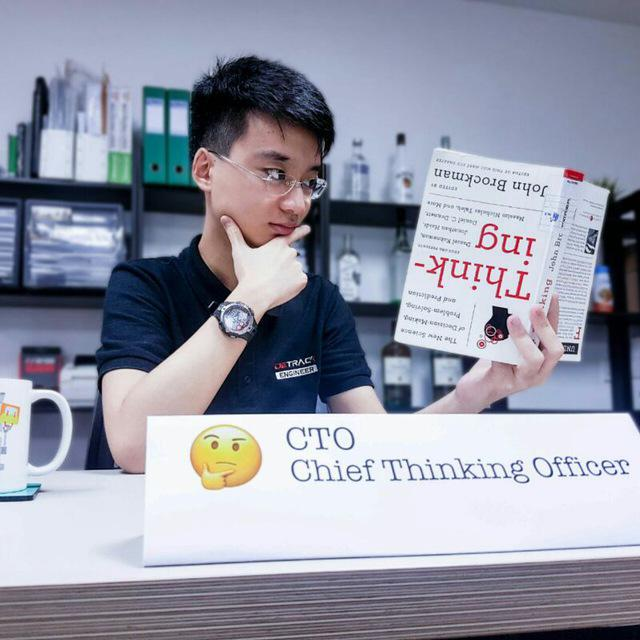

# InfoSys+
#### The pilot student programme for class of 2021

*TL;DR:*
- 2019 run of Infosys will have less content overload and exam scope
- Two optional student-led classes to run in parallel to help you make cool shit for 1D
- Check class schedule [here](#class-curriculum--schedule)

## What is InfoSys+?

Infosys+ was born out of the frustrations of multiple batches of seniors who had repeatedly complained that the second half of Infosys had a content overload. There was too much content crammed in the remaining four weeks, and this left many seniors playing gambles on what was going to be tested on the final exam or not. _(Spoiler: they weren't tested at all!)_

This anxiety leaves students distracted from working on the 1D projects that would otherwise produce very exciting and fulfilling student projects.

As the result of some gentle table banging during summer term, [3DC](https://sites.google.com/view/digitaldevs/home) and [OpenSUTD](https://opensutd.org) were able to negotiate for a reduced scope in curriculum, in exchange for student interest led classes that covers some content that were pulled out from the official curriculum. The benefit is that students (you) **have less things to mug for the exam**, and you **choose what you want to learn.** Hate dealing with Android fragments? Allergic to Databases? Hyped over Computer Vision? Go help your team with API Integration instead!

These classes will be taught by student helpers from the 3DC Google Student Developer Club. The next section covers in detail the contents of the classes in detail.

## Class Curriculum & Schedule

Before we continue, we would like to reiterate that these classes are **optional** and **interest-based**. Nothing taught in these classes will be tested in the exam, _but_ it might reinforce your understanding of underlying concepts that may come out in the exam. These classes are more for you to make cool shit for your 1D projects and/or help your in your personal learning journeys in the domains you are interested in.

Due to manpower constraints, we can only accommodate 30 participants per class. We suggest you send a group member interested in the domain knowledge being taught to represent your group, so your group as a whole benefits from this additional knowledge.

### Advanced Android Components
This is a advanced android lesson series which touches on and demonstrates more features you can do with Android.
Fragments and Custom Views provide new ways to interact with the UI, and Sensors and Query provide your app with new information that you can use in your projects!

{:.timeline}
- __Fragments and Fragment Communication__{:.title}
  - {:.date} 12 Nov
  - {:.desc} Fragments are an alternative to views that can provide re-usable pieces of user interfaces present throughout your Android application. Find out how to use this to your advantage to minimise copy-pasting and encourage clean code.
- __Custom Views__{:.title}
  - {:.date} 19 Nov
  - {:.desc} Views make up the individual components you see in your application's screen. This goes through the additional views not found in class that you might find useful.
- __Sensors and Query API__{:.title}
  - {:.date} 26 Nov
  - {:.desc} Did you know your smartphone contains well over a dozen sensors? Learn how to access these sensor data such as GPS, compass and gyroscope to add new dimensions to your user experience.
- __App Widgets__{:.title}
  - {:.date} 3 Dec
  - {:.desc} App widgets are like "mini applications" that go onto the user's home screen, something like the music player widget. Learn to create a custom widget for your application that your user can install onto their home screen.

#### Who should attend this class
- Students interested in front-end mobile application development
- Students whose projects involve a heavy front-end user experience

#### About the class lead

{:.profile_desc}
[Caleb](https://opensutd.org/#people-caleb) is the president of the Digital Design and Development Club, and SUTD's Google Student Developers Representative. He has a passion in building mobile applications to deliver beautiful user experiences.

### REST APIs & Databases
This series introduces the concept of REST APIs, the backbone of many Internet-connected applications today. Learn how to make your application connect to the Internet and retrieve data from your services hosted in the cloud.

{:.timeline}
- __Introduction to REST: Making HTTP calls in Java__{:.title}
  - {:.date} 7 Nov
  - {:.desc} Learn the basics of HTTP and how to communicate in HTTP in plain Java. At the end of this session, you'll make a Java application that tells you the current weather.
- __Cloud Functions: Introduction to Microsoft Azure Cloud__{:.title}
  - {:.date} 14 Nov
  - {:.desc} Find out how to run Java code "in the cloud". Building upon the knowledge of the previous session, learn how to call your own API from your Android application.
- __Leveraging Cloud Providers: Computer Vision Example__{:.title}
  - {:.date} 21 Nov
  - {:.desc} Now that you have code that lives on the cloud, you can do anything. Learn how to integrate Azure's AI services to add Computer Vision capabilities to your application.
- __Persisting Data on the Cloud: Cloud Store__{:.title}
  - {:.date} 28 Nov
  - {:.desc} You know how to save data on the phone, but what about online? Learn how to use simple online key-value stores for small applications.
- __(Bonus: ) Relational Database Theory__{:.title}
  - {:.date} 5 Dec   &   12 Dec (TBC)
  - {:.desc} As our data structures become more complex, we can no longer use simple key-value stores. A relational database is an online Excel spreadsheet on crack – very powerful, but significantly harder to learn and use. We learn basic database design techniques and how to interface them with an application.
  - {:.desc} **Tentative:** these dates occur after the date of the 1D checkoff (2 Dec), so these lessons are really just for fun for those who are interested. Will run depending on student interest and reception.

#### Who should attend this class
  - Students interested in back-end & cloud development
  - Students whose projects involve more computations and services on the cloud than on the end user device

#### About the class lead

{:.profile_desc}
[Chester](https://opensutd.org/#people-chester) is the Vice President of the Digital Design and Development club and also the kickstarter of Infosys+. He is primarily interested in cloud development and actively contributes to open source software and toolchains on Github.

## We need help!
Thanks to the support of ISTD, we can give out student helper rates for students who are interested in acting as TA's for these lessons. If you are interested, please email Chester at chester_koh[at]mymail.sutd.edu.sg with your details ASAP.

## Behind The Scenes
The InfoSys+ programme was first initiated by Chester, on behalf of 3DC and OpenSUTD, during summer. He now works closely with the ISTD faculty, OpenSUTD and the students to improve student experience in ISTD.

As with OpenSUTD's operating philosophies, everything we do is open and transparent. Take a look at the original pitch slides we used to convince the ISTD faculty to support this programme [here](https://sutdapac-my.sharepoint.com/:b:/g/personal/chester_koh_mymail_sutd_edu_sg/EX1ZzjwGb7BGiKljq31JlrUBkQbvrFYw5i3M8_MfmupTbA?e=0HPNcQ).
