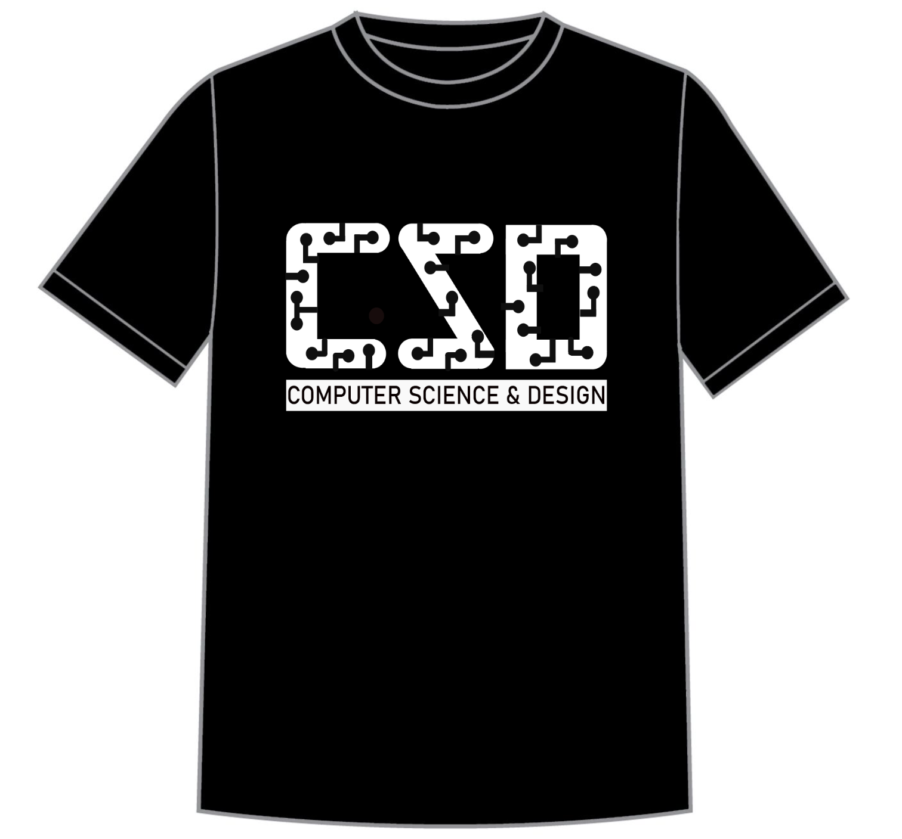
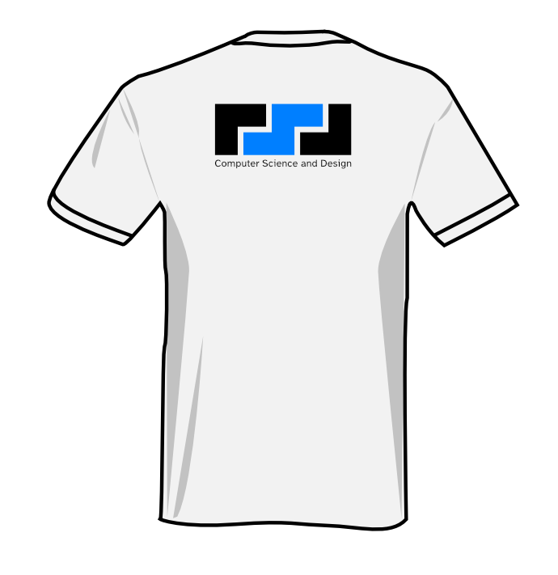
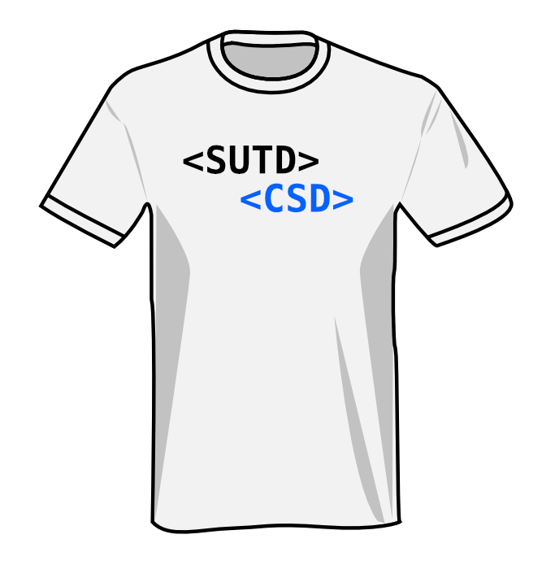
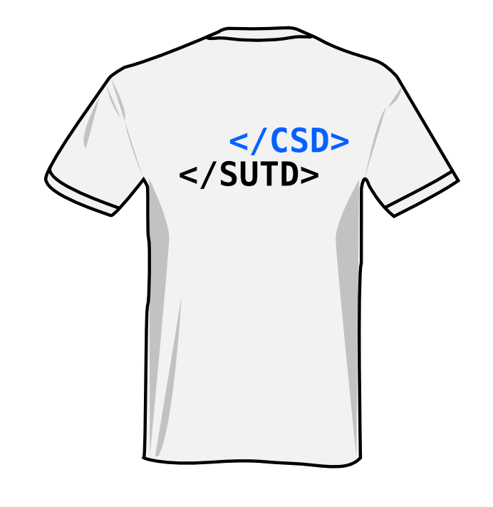
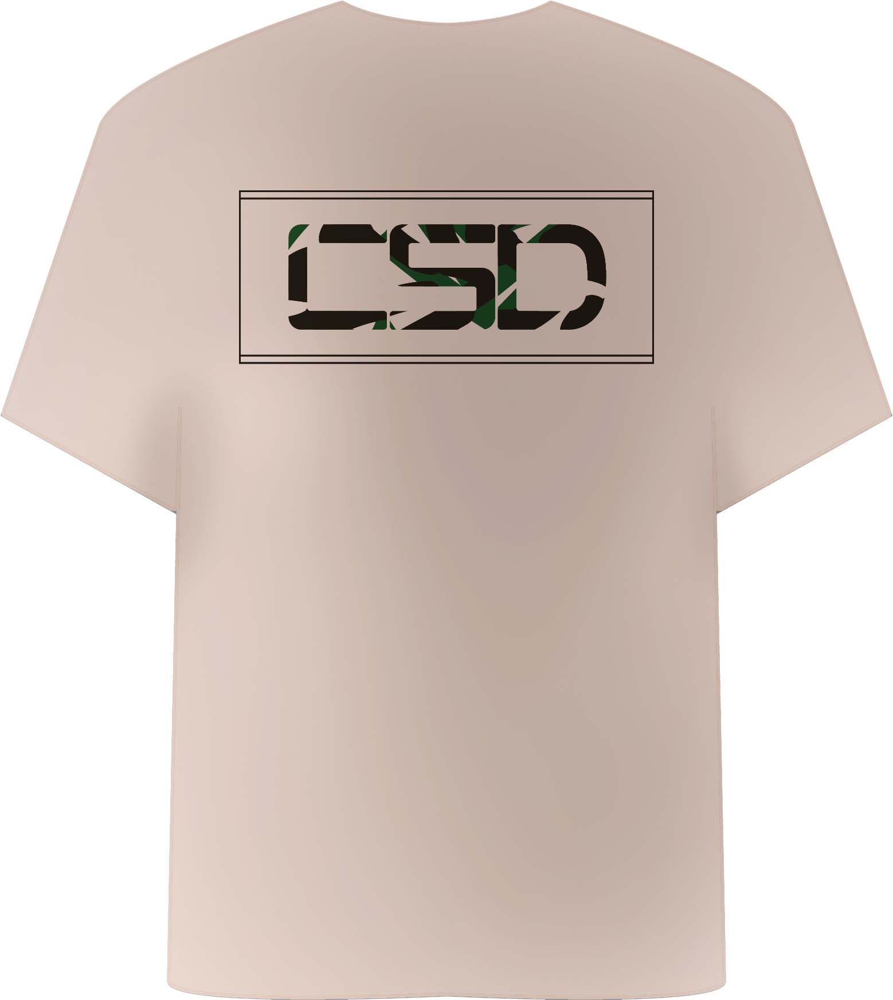
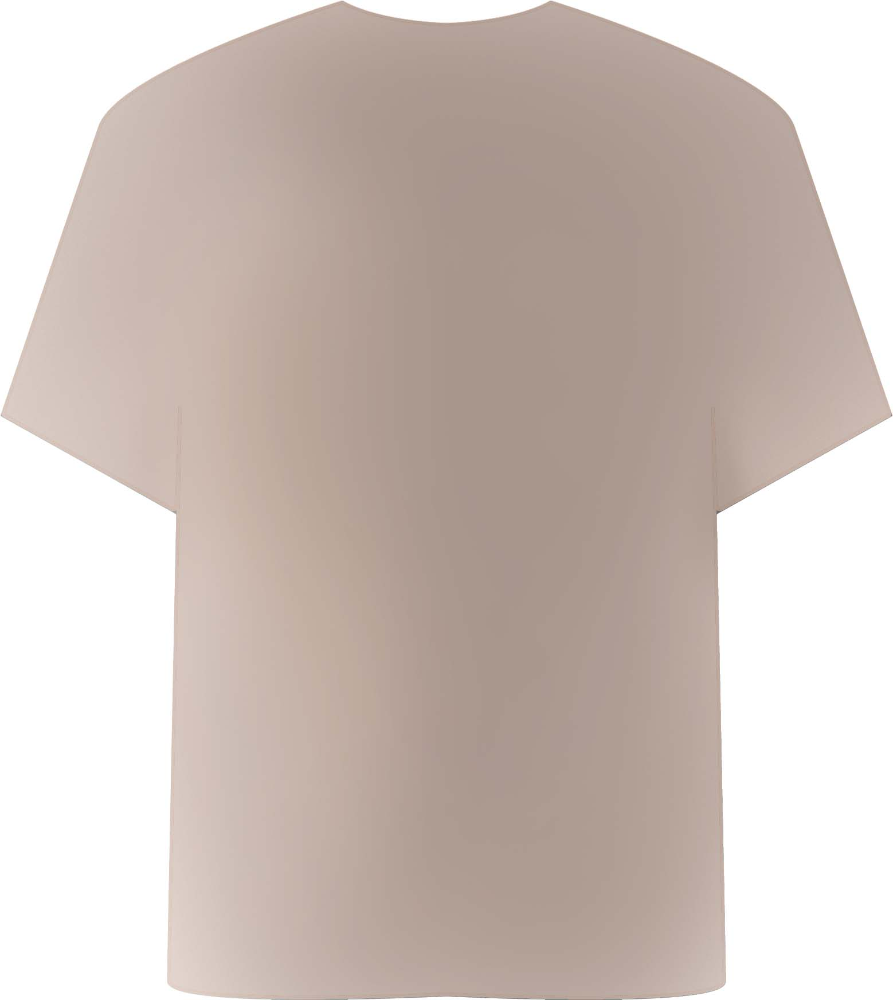
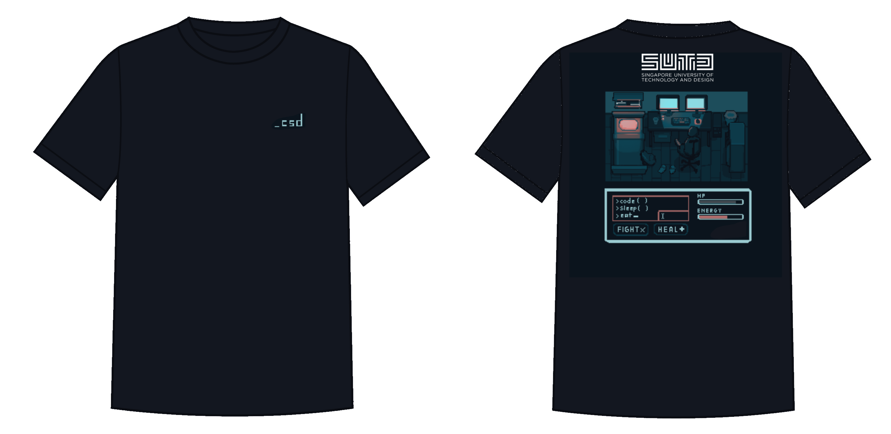
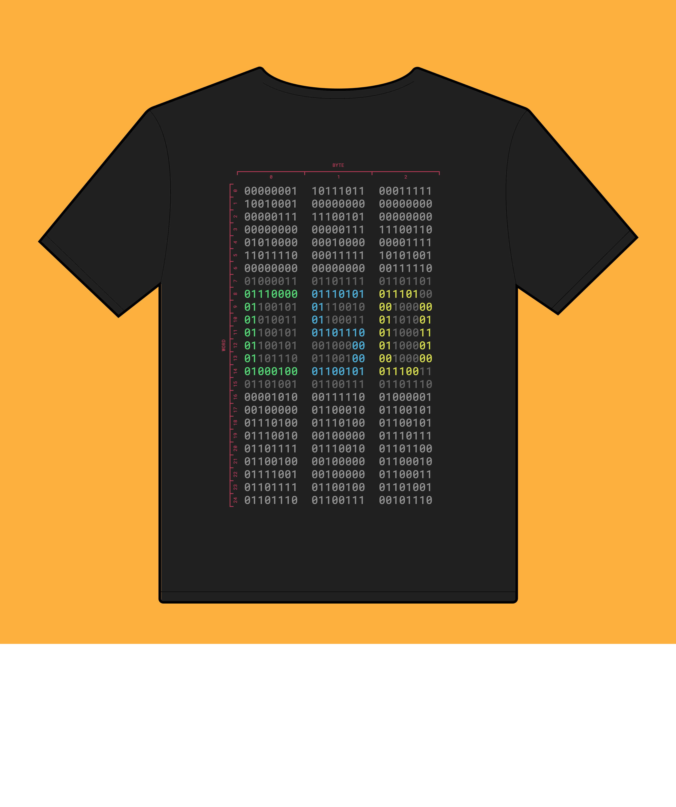
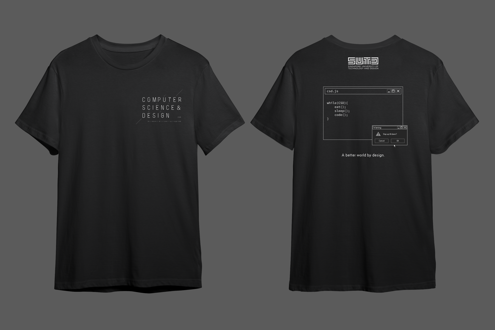

# CSD T-shirt Voting

## Important Notes

-   Each voter will cast 3 votes, please vote for your first, second and third favorite design.
-   Each person's first vote will count as 2 points, second vote as 1.5 points and third vote as 1 point. The design with the highest total points will be the winner.
-   You can vote for the same design in all three ballots and the points will accumulate.
-   We will collect information about your T-shirt size in the voting form. All voters will receive a CSD t-shirt. If you don't vote, we won't know your size.
-   Please vote for your favorite designs & register for a free CSD t-shirt <a href="https://forms.office.com/r/BmqC9KRvGV" target="_blank" rel="noopener noreferrer"><b>[here]</b></a>.

### Eligible Voters

-   **All CSD Juniors** (Class of 2022)
-   **Incoming CSD Sophomores** (Class of 2024)
-   Graduate Students/Faculty/Staff/Researchers <u>affiliated to ISTD Pillar</u>

\*\* Eligible voters who actually vote will receive the new CSD T-shirt (for free) in the spring of 2022.

### T-shirt Size

You may refer to the following table or <a href="https://theteeinkers.com/img/colorSize/sizeChart20170211.png" target="_blank" rel="noopener noreferrer">here</a> for the size of the T-shirt:

## Submission Showcase

-   This page is better viewed on desktops.
-   Right click on the image and "Open image in new tab" to view full-size image.

|  #  | Designer           |
| :-: | :----------------- |
|  A  | @foolishprovidence |
|  B  | @kitkatyj          |
|  C  | @o_hnJ             |
|  D  | @catbun            |
|  E  | @sean_gunawan      |
|  F  | @oldsparrow        |
|  G  | @hobo_chow         |

<table class="table">
  <thead>
    <tr>
      <th scope="col">#</th>
      <th scope="col">Front</th>
      <th scope="col">Back</th>
    </tr>
  </thead>
  <tbody>
    <tr>
      <th scope="row">A1</th>
      <td></td>
      <td></td>
      <!-- <td style="vertical-align:top">@foolishprovidence</td> -->
    </tr>
    <tr>
      <th scope="row">B1</th>
      <td></td>
      <td></td>
      <!-- <td rowspan="3" style="vertical-align:top">@kitkatyj</td> -->
    </tr>
    <tr>
      <th scope="row">B2</th>
      <td></td>
      <td></td>
    </tr>
    <tr>
      <th scope="row">B3</th>
      <td></td>
      <td></td>
    </tr>
    <tr>
      <th scope="row">C1</th>
      <td></td>
      <td></td>
      <!-- <td rowspan="3" style="vertical-align:top">@o_hnJ</td> -->
    </tr>
    <tr>
      <th scope="row">C2</th>
      <td></td>
      <td></td>
    </tr>
    <tr>
      <th scope="row">C3</th>
      <td></td>
      <td></td>
    </tr>
    <tr>
      <th scope="row">D1</th>
      <td colspan="2"></td>
      <!-- <td rowspan="4" style="vertical-align:top">@catbun</td> -->
    </tr>
    <tr>
      <th scope="row">D2</th>
      <td colspan="2"></td>
    </tr>
    <tr>
      <th scope="row">D3</th>
      <td colspan="2"></td>
    </tr>
    <tr>
      <th scope="row">D4</th>
      <td colspan="2"></td>
    </tr>
    <tr>
      <th scope="row">E1</th>
      <td></td>
      <td></td>
      <!-- <td style="vertical-align:top">@sean_gunawan</td> -->
    </tr>
    <tr>
      <th scope="row">F1</th>
      <td colspan="2"></td>
      <!-- <td rowspan="6" style="vertical-align:top">@oldsparrow</td> -->
    </tr>
    <tr>
      <th scope="row">F2</th>
      <td colspan="2"></td>
    </tr>
    <tr>
      <th scope="row">F3</th>
      <td colspan="2"></td>
    </tr>
    <tr>
      <th scope="row">F4</th>
      <td colspan="2"></td>
    </tr>
    <tr>
      <th scope="row">F5</th>
      <td colspan="2"></td>
    </tr>
    <tr>
      <th scope="row">F6</th>
      <td colspan="2"></td>
    </tr>
    <tr>
      <th scope="row">G1</th>
      <td></td>
      <td></td>
      <!-- <td rowspan="3" style="vertical-align:top">@hobo_chow</td> -->
    </tr>
    <tr>
      <th scope="row">G2</th>
      <td></td>
      <td></td>
    </tr>
    <tr>
      <th scope="row">B3</th>
      <td></td>
      <td></td>
    </tr>
  </tbody>
</table>

Please vote for your favorite designs & register for a free CSD t-shirt <a href="https://forms.office.com/r/BmqC9KRvGV" target="_blank" rel="noopener noreferrer"><b>[here]</b></a>
