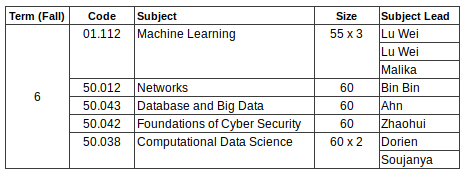

# Collated Q&A for ISTD Term 6 Courses for 2019

##### Will the timetable committee release the timetable for ISTD mods?

Felice is still in discussion with the timetable committee to release the timetable earlier, so we'll have to wait for their reply first. But just a disclaimer: as the timetable is created in consideration of the needs of all stakeholders (the student survey we've received, and the faculties that will be teaching), the process of developing the timetable is a long one, and it's creation is hence considered finalized.

##### Which profs will be teaching for which mods, and what is the cap on student enrollment for each mods?

Credits:

ISTD staffs Felice and Irma are keeping in close contact with us to answer these questions. Big shout out to them!